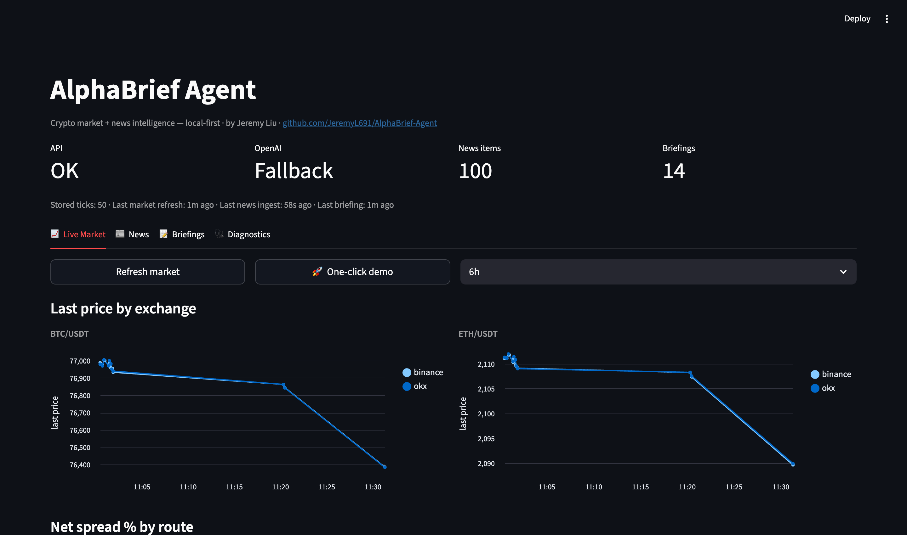
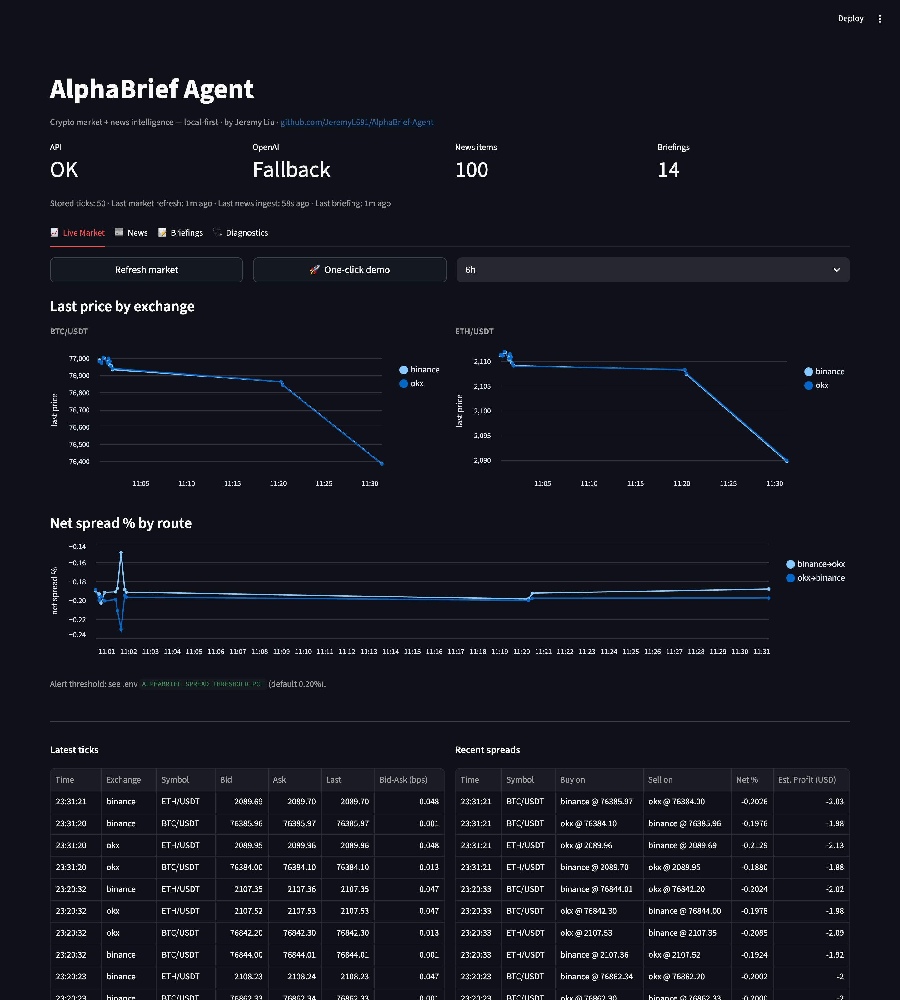
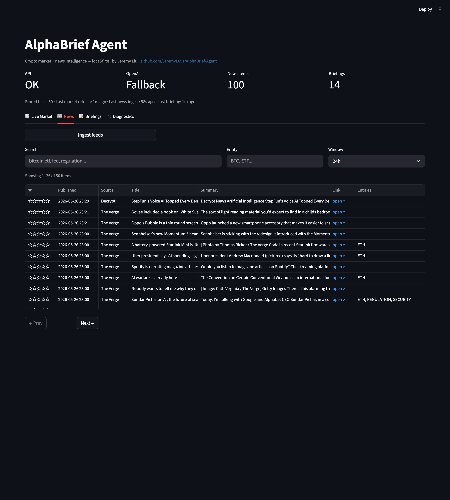
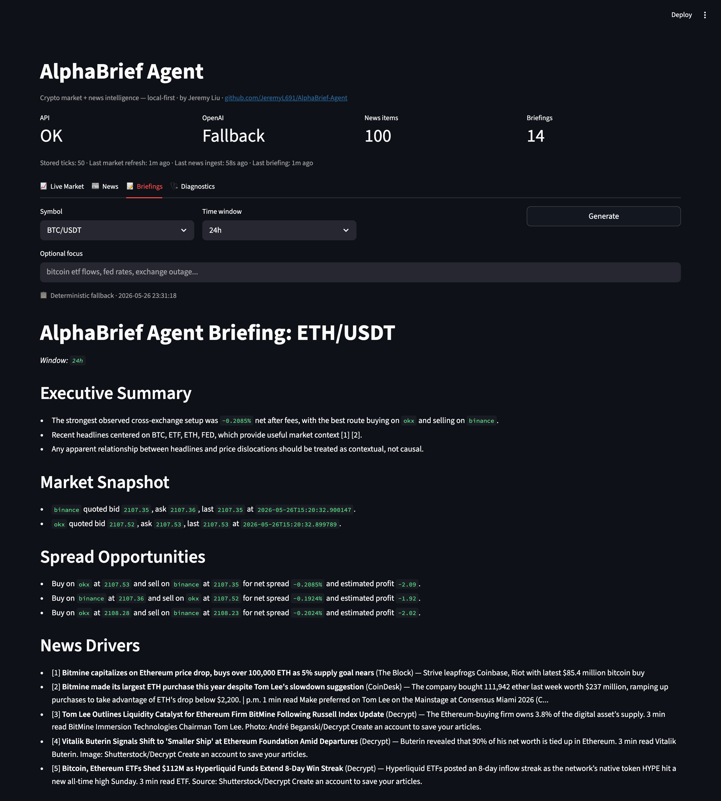
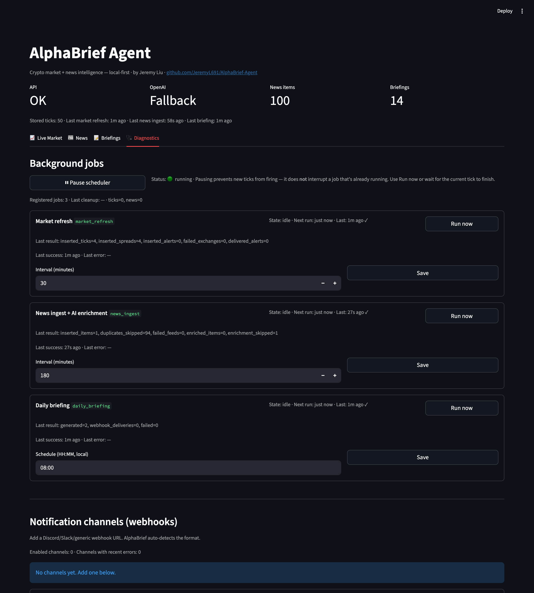
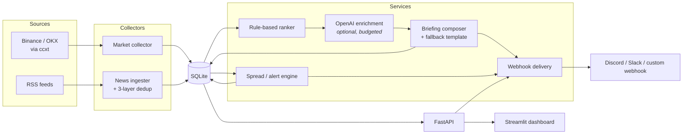

# AlphaBrief Agent

> A local-first crypto market & news briefing agent — turns Binance / OKX quotes and curated RSS feeds into a single morning briefing you can actually read.




<p align="center"><em>One local app, one morning briefing. See <a href="reports/sample_daily_briefing.md">a sample briefing</a>.</em></p>

---

## Why this exists

Every morning I was bouncing between Binance, OKX, an RSS reader and a stack of news tabs just to figure out *"is anything actually worth looking at today?"* AlphaBrief Agent collapses that into one local app: pull quotes, pull news, score & dedup, then write a short briefing I can scan in 30 seconds.

It is intentionally a **focused local tool**, not a trading bot, not a SaaS, and not an "autonomous agent platform."

---

## What it does

**🪙 Live market monitor** — Pulls `BTC/USDT` & `ETH/USDT` quotes from Binance and OKX, computes fee-adjusted cross-exchange spreads, and raises alerts when a route crosses a configurable threshold.



**📰 News pipeline** — Ingests several crypto / tech RSS feeds, deduplicates by URL + title hash + content hash, and ranks items locally with rule-based relevance scoring before any LLM call.



**📝 Daily briefing** — Generates a structured markdown briefing (market snapshot → spread opportunities → relevant news → interpretation → risk notes → sources). OpenAI is optional; the app falls back to a deterministic template if the key is missing, the budget is spent, or the model returns malformed output.



→ See an example: [reports/sample_daily_briefing.md](reports/sample_daily_briefing.md)

**⏱️ Background scheduler + webhook delivery** — Runs market refresh, news ingest, and briefing generation on a schedule. Pushes alerts and briefings to Discord / Slack / generic webhooks, with delivery status broken out into `delivered / partial_failure / failed`.



---

## Architecture



---

## Engineering highlights

Things in here that go a bit beyond "wire up an API and call it a day":

- **Fee-adjusted spreads.** Cross-exchange edge is computed after a configurable double-sided taker fee, so the alert stream doesn't fire on phantom opportunities.
- **Three-layer news dedup.** URL → normalized title hash → content hash. Survives feeds that republish the same story under slightly different URLs.
- **Local-first ranking before LLM.** Rule-based relevance scoring runs first; OpenAI is only invoked for items worth enriching, behind a **daily USD budget cap** that hard-stops further calls when exceeded.
- **Briefing fallback path.** If the model returns broken structure (missing sections, malformed markdown), the composer detects it and re-emits a deterministic template instead of shipping garbage to the user.
- **Explicit scheduler state machine.** Each job reports `idle / running / skipped / error`, can be triggered manually from the dashboard, and surfaces last-run summaries in `/health`.
- **Self-repairing launcher.** The one-click starters recreate `.venv` if missing, re-install dependencies when imports fail, copy `.env.example → .env` if absent, and wait for *both* the API and dashboard to be reachable before opening the browser.
- **Partial-failure aware notifications.** A webhook batch is classified `delivered / partial_failure / failed`; the dashboard shows the actual HTTP status and error tail per channel.
- **One source of truth for host/port config.** Manual mode and one-click mode read the same `.env`, so there's no API base URL drift between launch paths.
- **Reasonable test coverage of the demo-critical paths.** Main API flow, retrieval ranking, briefing fallback, scheduler wiring, launcher dependency checks, maintenance cleanup, notification partial-failure — the things most likely to embarrass me on a live demo.

---

## Stack

| Layer | Choice |
|---|---|
| Backend | FastAPI |
| Dashboard | Streamlit |
| Storage | SQLite + SQLAlchemy |
| Market data | `ccxt` (Binance, OKX) |
| News | `feedparser` + custom dedup |
| LLM (optional) | OpenAI (`gpt-4o-mini` by default) |
| Scheduler | In-process, configurable from the DB |

Local-first by design: no Docker, no cloud dependency for the core app, no Electron shell.

---

## Running locally

### One-click (recommended for a demo)

**macOS:** double-click `Install-AlphaBrief.command`, then `Start-AlphaBrief.command`.
**Windows:** double-click `Install-AlphaBrief.bat`, then `Start-AlphaBrief.bat`.

The starters self-repair: they create `.venv` if missing, fall back to a fresh install when imports break, copy `.env.example → .env` when needed, and wait for both services to be ready before launching the browser.

### Manual

```bash
python3.11 -m venv .venv
source .venv/bin/activate
pip install -e ".[dev]"
cp .env.example .env

# terminal 1
uvicorn app.main:app --host 127.0.0.1 --port 8000
# terminal 2
streamlit run dashboard/streamlit_app.py
```

Default addresses:

- API: <http://127.0.0.1:8000> (OpenAPI docs at `/docs`)
- Dashboard: <http://127.0.0.1:8501>

---

## Configuration

Most settings live in `.env`. The dashboard scheduler cadence lives in the DB (`app_settings`) so it can be tuned without a restart.

| Variable | Default | Notes |
|---|---|---|
| `OPENAI_API_KEY` | empty | Leave empty to stay in deterministic fallback mode |
| `OPENAI_MODEL` | `gpt-4o-mini` | Current default model |
| `ALPHABRIEF_API_HOST` | `127.0.0.1` | API host |
| `ALPHABRIEF_API_PORT` | `8000` | API port |
| `ALPHABRIEF_DASHBOARD_PORT` | `8501` | Streamlit port |
| `ALPHABRIEF_FEE_RATE_PCT` | `0.10` | Per-side taker fee assumption |
| `ALPHABRIEF_SPREAD_THRESHOLD_PCT` | `0.20` | Alert threshold |
| `ALPHABRIEF_TICK_RETENTION_DAYS` | `7` | Tick retention window |
| `ALPHABRIEF_NEWS_RETENTION_DAYS` | `30` | News retention window |
| `ALPHABRIEF_AI_DAILY_BUDGET_USD` | `1.0` | Hard cap on daily LLM spend |

---

## Project layout

```text
app/
  main.py             # FastAPI entry
  config.py           # env-backed settings
  launcher.py         # self-repairing one-click launcher
  scheduler.py        # in-process job loop + state machine
  market/             # ccxt collectors + spread engine
  news/               # RSS ingest, dedup, ranking
  ai/                 # OpenAI enrichment (optional, budgeted)
  services/           # briefings, notifications, health, maintenance
dashboard/            # Streamlit UI
reports/              # sample + generated briefings
scripts/              # OS-specific setup/start scripts
tests/                # pytest suite
```

---

## API surface

Streamlit is the primary consumer, but everything is also exposed over plain REST:

```
GET   /health
POST  /market/refresh        GET /market/latest    GET /market/history
POST  /news/ingest           GET /news/items
POST  /briefings/generate    GET /briefings
GET   /alerts
GET   /scheduler/status      POST /scheduler/enabled    POST /scheduler/jobs/{id}/run
POST  /maintenance/cleanup
GET   /notifications/channels    GET /notifications/log
```

Full schema at `/docs` when the app is running.

---

## Tests

```bash
pytest
```

Covers main API flow, retrieval ranking, briefing fallback, scheduler wiring, launcher dependency checks, maintenance cleanup, and notification partial-failure handling.

---

## Roadmap

- [ ] Per-source news quality scoring (drop chronic noise feeds)
- [ ] Backtest harness for spread thresholds against historical ticks
- [ ] Scheduler / delivery recovery for transient outages
- [ ] Richer dashboard state feedback when a job is mid-flight
- [ ] More polished briefing prose without over-writing

---

## Troubleshooting

<details>
<summary><b>Port already in use</b></summary>

```bash
lsof -iTCP:8000 -sTCP:LISTEN
lsof -iTCP:8501 -sTCP:LISTEN
```
</details>

<details>
<summary><b>One-click startup does not come up</b></summary>

Check `data/logs/`. The launcher also prints a recent log tail when a child process exits unexpectedly.
</details>

<details>
<summary><b>OpenAI is not being used</b></summary>

Confirm `OPENAI_API_KEY` is set in `.env`, then check the AI usage / enrichment section in the Diagnostics tab.
</details>

<details>
<summary><b>Webhook test fails</b></summary>

Open *Recent deliveries* in Diagnostics — the actual HTTP status code and error tail show up there.
</details>

---

## About

Built by **Jeremy Liu** as a personal project to practice end-to-end product engineering: data collection, deduplication, scheduling, LLM integration with cost guardrails, and a clean local UX.

- GitHub: [@JeremyL691](https://github.com/JeremyL691)
- Email: [jeremyjiuyiliu@gmail.com](mailto:jeremyjiuyiliu@gmail.com)

## License

MIT — see [LICENSE](LICENSE).

> *Not financial advice.*
